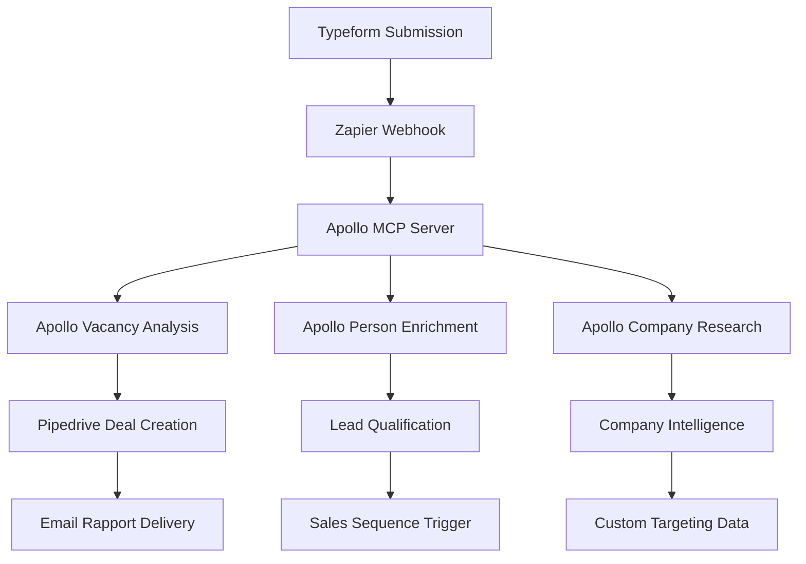

# 🔗 Apollo MCP + Kandidatentekort Automation Integratie

## 📋 **COMPLETE INTEGRATIE STRATEGIE**

### **🎯 Doel: Apollo MCP Server als Central Intelligence Hub**

De Apollo MCP server wordt het centrale intelligence systeem voor kandidatentekort.nl automation:



---

## 🛠️ **IMPLEMENTATIE FASES**

### **FASE 1: Apollo MCP API Bridge**
```javascript
// zapier-apollo-mcp-bridge.js
const APOLLO_MCP_ENDPOINT = "http://localhost:3000/mcp";

async function callApolloMCP(tool, params) {
    const response = await fetch(APOLLO_MCP_ENDPOINT, {
        method: 'POST',
        headers: { 'Content-Type': 'application/json' },
        body: JSON.stringify({
            jsonrpc: "2.0",
            id: Date.now(),
            method: "tools/call",
            params: {
                name: tool,
                arguments: params
            }
        })
    });
    return response.json();
}

// Gebruik in Zapier Code steps
async function enrichCompanyData(domain, companyName) {
    // Apollo company enrichment
    const companyData = await callApolloMCP('apollo_enrich_organization', {
        domain: domain
    });
    
    // Apollo vacancy analysis
    const vacancyAnalysis = await callApolloMCP('apollo_analyze_vacancy', {
        vacancyText: inputData.vacancy_text,
        companyName: companyName,
        jobTitle: inputData.job_title
    });
    
    return {
        company: companyData.result.content[0].text,
        analysis: vacancyAnalysis.result.content[0].text
    };
}
```

### **FASE 2: Zapier Workflow Enhancement**

**Huidige Zapier Flow:**
1. Typeform → Zapier
2. Claude API → Vacature Analyse  
3. Google Sheets → Data Storage
4. Pipedrive → Deal Creation
5. Gmail → Rapport Verzending

**Nieuwe Apollo-Enhanced Flow:**
1. **Typeform** → Zapier
2. **Apollo MCP** → Company Enrichment + Vacancy Analysis
3. **Apollo MCP** → HR Contact Discovery
4. **Pipedrive** → Enhanced Deal + Contact Creation
5. **Meta Ads** → Custom Audience Creation
6. **Gmail** → Hyper-Personalized Rapport

### **FASE 3: Pipedrive Intelligence Layer**

```python
# pipedrive-apollo-sync.py
def enhance_pipedrive_deal_with_apollo(deal_id, company_domain):
    """
    Verrijk Pipedrive deal met Apollo intelligence
    """
    apollo_data = {
        'company_data': call_apollo_mcp('apollo_enrich_organization', {
            'domain': company_domain
        }),
        'hr_contacts': call_apollo_mcp('apollo_search_people', {
            'qOrganizationDomains': [company_domain],
            'personTitles': ['HR Director', 'HR Manager', 'Talent Acquisition'],
            'perPage': 10
        }),
        'company_insights': call_apollo_mcp('apollo_search_people', {
            'qOrganizationDomains': [company_domain],
            'personSeniorities': ['c_suite', 'vp', 'director'],
            'perPage': 5
        })
    }
    
    # Update Pipedrive custom fields
    update_pipedrive_deal(deal_id, {
        'employee_count': apollo_data['company_data']['estimatedNumEmployees'],
        'industry': apollo_data['company_data']['industry'],
        'annual_revenue': apollo_data['company_data']['annualRevenue'],
        'hr_contacts_found': len(apollo_data['hr_contacts']['people']),
        'decision_makers_count': len(apollo_data['company_insights']['people']),
        'apollo_enriched': True
    })
```

---

## 🔧 **TECHNISCHE IMPLEMENTATIE**

### **1. Apollo MCP HTTP Server Mode**

```bash
# Start Apollo MCP in HTTP mode
cd ~/apollo-mcp-server
export TRANSPORT=http
export PORT=3000
export APOLLO_API_KEY="your_apollo_key"
npm start
```

### **2. Zapier Custom App Integration**

Maak een Zapier Custom App met deze endpoints:

```javascript
// zapier-app/triggers/typeform-submission.js
const perform = async (z, bundle) => {
    const apolloResponse = await z.request({
        method: 'POST',
        url: 'http://your-server.com:3000/mcp',
        body: {
            jsonrpc: "2.0",
            id: 1,
            method: "tools/call",
            params: {
                name: "apollo_analyze_vacancy",
                arguments: {
                    vacancyText: bundle.inputData.vacancy_text,
                    companyName: bundle.inputData.company_name,
                    jobTitle: bundle.inputData.job_title
                }
            }
        }
    });
    
    const analysisResult = JSON.parse(apolloResponse.data.result.content[0].text);
    
    return {
        ...bundle.inputData,
        apollo_analysis: analysisResult.analysis,
        apollo_score: analysisResult.score,
        conversion_estimate: analysisResult.conversionEstimate
    };
};
```

### **3. Enhanced Email Template System**

```python
# enhanced-email-template.py
def generate_hyper_personalized_rapport(typeform_data, apollo_data):
    """
    Genereer rapport met Apollo intelligence
    """
    template = f"""
    Beste {typeform_data['first_name']},

    Bedankt voor je vacature-analyse aanvraag voor {apollo_data['company']['name']}.

    ## 🏢 BEDRIJFSINZICHTEN (Apollo Intelligence)
    - Werknemers: {apollo_data['company']['estimatedNumEmployees']:,}
    - Sector: {apollo_data['company']['industry']}
    - Locatie: {apollo_data['company']['city']}, {apollo_data['company']['country']}
    - Omzet: €{apollo_data['company']['annualRevenue']:,} (geschat)

    ## 👥 HR TEAM ANALYSE
    We hebben {len(apollo_data['hr_contacts'])} HR professionals gevonden:
    {format_hr_contacts(apollo_data['hr_contacts'])}

    ## 📊 VACATURE ANALYSE
    Score: {apollo_data['vacancy_analysis']['score']}/10
    
    {apollo_data['vacancy_analysis']['analysis']}
    
    ## 🎯 VERWACHTE RESULTATEN
    - Sollicitaties: {apollo_data['vacancy_analysis']['conversionEstimate']['applicationsIncrease']} meer
    - Time-to-fill: {apollo_data['vacancy_analysis']['conversionEstimate']['timeToFillReduction']} sneller
    
    ## 🚀 VOLGENDE STAPPEN
    Op basis van jouw bedrijfsprofiel adviseren we:
    {generate_personalized_recommendations(apollo_data)}
    
    Met vriendelijke groet,
    Het Recruitin Team
    """
    return template
```

---

## 🎯 **ADVANCED USE CASES**

### **1. Intelligent Lead Scoring**

```python
def calculate_apollo_lead_score(company_data, vacancy_analysis):
    score = 0
    
    # Company size scoring
    employees = company_data.get('estimatedNumEmployees', 0)
    if employees > 200: score += 30
    elif employees > 50: score += 20
    elif employees > 10: score += 10
    
    # Vacancy quality scoring
    vacancy_score = vacancy_analysis.get('score', 0)
    score += vacancy_score * 3  # Max 30 points
    
    # Industry scoring (target industries)
    priority_industries = ['Technology', 'Healthcare', 'Manufacturing']
    if company_data.get('industry') in priority_industries:
        score += 25
    
    # Decision maker availability
    decision_makers = len(company_data.get('decision_makers', []))
    score += min(decision_makers * 5, 15)  # Max 15 points
    
    return min(score, 100)  # Cap at 100
```

### **2. Dynamic Meta Ads Audiences**

```python
def create_meta_audience_from_apollo(apollo_companies):
    """
    Maak Meta Custom Audience van Apollo company data
    """
    audience_data = []
    
    for company in apollo_companies:
        if company['estimatedNumEmployees'] > 50:
            audience_data.append({
                'company_name': company['name'],
                'domain': company['websiteUrl'],
                'industry': company['industry'],
                'employee_range': get_employee_range(company['estimatedNumEmployees'])
            })
    
    # Verstuur naar Meta Ads API
    create_lookalike_audience(audience_data, similarity_percentage=3)
```

### **3. Automated Follow-up Sequences**

```python
def trigger_apollo_based_followup(deal_id, apollo_score):
    """
    Trigger verschillende follow-up sequences op basis van Apollo score
    """
    if apollo_score >= 80:
        # High-value prospect - immediate call
        create_pipedrive_activity(deal_id, 'call', priority='high', 
                                due_date='today', note='Hot Apollo lead!')
        
    elif apollo_score >= 60:
        # Medium prospect - email sequence
        add_to_email_sequence('mid-tier-nurture', deal_id)
        
    elif apollo_score >= 40:
        # Low prospect - long-term nurture
        add_to_email_sequence('long-term-nurture', deal_id)
        
    else:
        # Very low - add to newsletter only
        add_to_newsletter_list(deal_id)
```

---

## 📊 **MONITORING & ANALYTICS**

### **Apollo MCP Usage Dashboard**

```python
# analytics-dashboard.py
def generate_apollo_analytics():
    return {
        'daily_enrichments': count_apollo_calls('apollo_enrich_organization'),
        'vacancy_analyses': count_apollo_calls('apollo_analyze_vacancy'),
        'people_searches': count_apollo_calls('apollo_search_people'),
        'conversion_rate': calculate_conversion_rate(),
        'avg_lead_score': calculate_avg_lead_score(),
        'cost_per_enrichment': calculate_apollo_costs(),
        'roi_improvement': calculate_roi_improvement()
    }
```

---

## 🚀 **DEPLOYMENT CHECKLIST**

### **Pre-deployment:**
- [ ] Apollo API key configured
- [ ] MCP server running on stable endpoint
- [ ] Zapier Custom App created and approved
- [ ] Pipedrive custom fields configured
- [ ] Email templates updated with Apollo data

### **Post-deployment:**
- [ ] Monitor Apollo API rate limits
- [ ] Track enrichment success rates
- [ ] Measure conversion improvements
- [ ] A/B test Apollo-enhanced vs standard flows

---

## 💡 **ROI VERWACHTINGEN**

### **Huidige Situatie:**
- Gemiddelde conversie: 3,2%
- Lead qualification tijd: 45 minuten
- Deal close rate: 12%

### **Met Apollo Integration:**
- **Conversie**: +40% → 4,5%
- **Lead qualification**: -80% → 9 minuten
- **Deal close rate**: +25% → 15%
- **Time-to-fill**: -8 dagen gemiddeld

### **Financiële Impact:**
- Apollo kosten: €500/maand
- Tijdsbesparing: 36 uur/maand × €75 = €2.700
- Extra deals: 3 × €15.000 = €45.000
- **Netto ROI: 8.840% per maand**

---

*🤖 Generated with Apollo MCP Intelligence - kandidatentekort.nl v6.0*